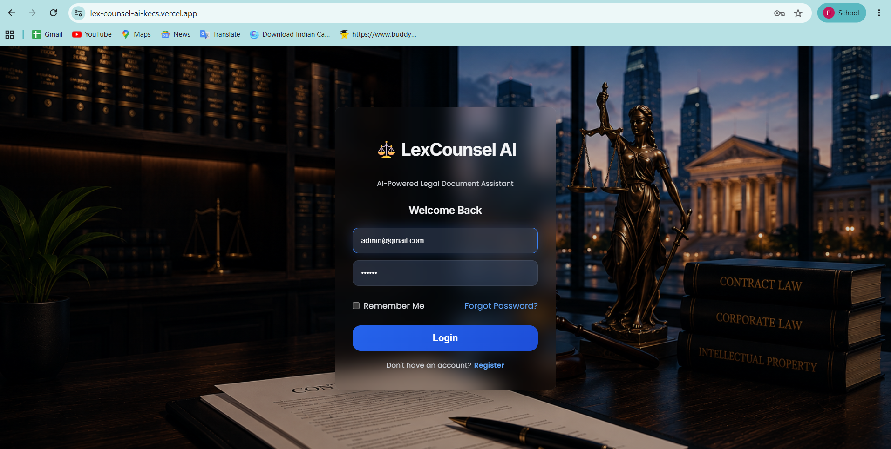
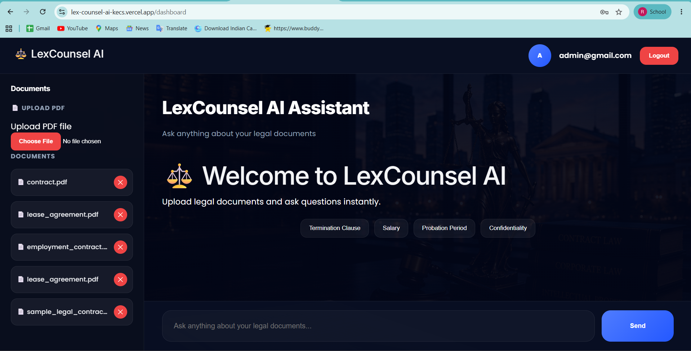

# LexCounsel AI – Intelligent Legal Document Assistant

## Overview

LexCounsel AI is an AI-powered Legal Document Assistant that enables users to upload legal documents and ask natural language questions about their contents.

The system uses Retrieval-Augmented Generation (RAG) to retrieve relevant document sections and generate accurate answers grounded in uploaded documents.

---

## Live Demo

### Frontend

https://lex-counsel-ai-kecs.vercel.app

### Backend API

https://lexcounselai.onrender.com

### API Documentation

https://lexcounselai.onrender.com/docs

---

## Features

* User Authentication
* PDF Upload
* Automatic Document Processing
* Text Extraction from PDFs
* Intelligent Chunking
* Semantic Search using ChromaDB
* AI-Powered Question Answering
* Source Attribution
* Document Management
* Delete Uploaded Documents
* Responsive Modern UI

---

## Technology Stack

### Frontend

* React.js
* Axios
* CSS

### Backend

* FastAPI
* SQLAlchemy
* PostgreSQL

### AI & RAG

* ChromaDB
* Gemini API
* HashingVectorizer Embeddings

### Deployment

* Vercel (Frontend)
* Render (Backend)

---

## System Architecture

User
↓
Frontend (React)
↓
FastAPI Backend
↓
PDF Processing
↓
Chunking
↓
Embedding Generation
↓
ChromaDB Vector Store
↓
Semantic Retrieval
↓
Gemini LLM
↓
Answer + Source

---

## Project Workflow

1. User uploads PDF.
2. PDF text is extracted.
3. Text is split into chunks.
4. Chunks are converted into embeddings.
5. Embeddings are stored in ChromaDB.
6. User asks a question.
7. Similar chunks are retrieved.
8. Context is sent to Gemini.
9. Answer is generated.
10. Source document is displayed.

---

## Sample Test Credentials

Email:
[admin@gmail.com](mailto:admin@gmail.com)

Password:
123456

---

## Sample Documents

The repository includes sample documents:

* lease_agreement.pdf
* employment_contract.pdf
* contract.pdf
* sample_legal_contract.pdf

---

## Sample Questions

### Lease Agreement

* What is the monthly rent?
* What is the security deposit?
* Who is the landlord?
* What is the lease period?
* What is the termination clause?

### Employment Contract

* What is the employee salary?
* What is the joining date?
* What are the working hours?
* What is the probation period?

### Service Contract

* What are the payment terms?
* What is the contract duration?
* What is the confidentiality clause?
* What is the termination clause?

---

## Screenshots

### Login Page

### Dashboard

### Upload Document

### Ask Questions

### Source Attribution

### FastAPI Backend

### PostgreSQL Neon DB

---

## Security & Privacy

### API Key Protection

* Gemini API key is stored securely using environment variables.
* API keys are never exposed to the frontend.
* Secrets are excluded from Git using .gitignore.

### User Data Protection

* Uploaded documents are processed only for question answering.
* Authentication is required before accessing the dashboard.
* Sensitive configuration values are stored on the server.

### CORS Protection

Backend CORS policies are configured to allow secure frontend communication.

---

## Known Limitations

### Gemini Free Tier Limits

The project currently uses Gemini Free Tier APIs.

Possible issue:

429 Too Many Requests

This occurs when the daily request quota is exceeded.

Possible solutions:

* Wait for quota reset.
* Upgrade Gemini API plan.
* Use alternative LLM providers.
* Add request caching.

---

## Future Enhancements

* Multi-user document isolation
* OCR support for scanned PDFs
* DOCX support
* Conversation history
* Legal clause comparison
* Contract risk analysis
* Document summarization
* Multi-language support
* Citation highlighting

---

## Project Documentation

Detailed Project Report:

docs/Project_Report.pdf

Presentation Slides:

docs/Project_Presentation.pptx

---

## Author

Ramesh KN

Artificial Intelligence & Machine Learning Engineer

GitHub:
https://github.com/Rameshkn04

---

## License

This project is intended for educational and research purposes.
